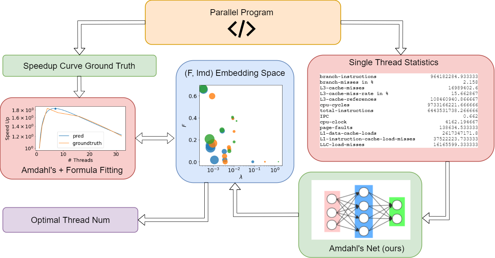

# Amdahl’s Net: Optimal Performance Prediction WithFirst-Order Linear Overhead Assumption

**Author:** `Yintao, Xu(yintao.xu@nyu.edu)`, `Zibo, Wang(zw2574@nyu.edu)`

**Date**: `2021/11/29`

This is the codebase for NYU multicore final project.

Predicting the performance of parallel applications has served different objectives, including capacity planning, elastic scaling,  improve  utilization  of  system  resource  and  detecting system  bottlenecks.   We  in  this  paper  proposed  Amdahl’s Plus Formula in order to better fit the performance of the program by concerning the overhead of multi-threading and synchronization.  Results show that our method is effective in finding out the optimized thread number, which is a guidance for developers in improving the performance of parallel system.

## Overview

The project mainly bases on python3. 

- It uses `build_all.py`, `collect_stat.py`, `collect_time.py` to construct datasets as .csv files. 
- The prediction statistically learning models are implemented in Jupyter notebooks. 
- Anaconda3 is recommended as integrated python distribution version.

## Notebooks

1. [Data Preprocess.ipynb](https://github.com/liubai01/Multicore-NYU-2021/blob/master/Data%20Preprocess.ipynb): Include description how we construct the dataset.
2. [Amdahl's law.ipynb](https://github.com/liubai01/Multicore-NYU-2021/blob/master/Amdahl's%20law.ipynb): Visualize Amdahl's law and propose Amdahl's plus law.
3. [Amdahls' Net.ipynb](https://github.com/liubai01/Multicore-NYU-2021/blob/master/Amdahl's%20Net.ipynb): Train the Amdahl's law to predict optimal thread numbers.
3.  [Baselines.ipynb](https://github.com/liubai01/Multicore-NYU-2021/blob/master/Baselines.ipynb): Provide baseline methods for comparison.

## Experiment Result

The prediction of optimal thread and speedup.

- For experiment of Amdahl's Net, refer to [Amdahls' Net.ipynb](https://github.com/liubai01/Multicore-NYU-2021/blob/master/Amdahl's%20Net.ipynb).
- For the rest of experiment, refer to [Baselines.ipynb](https://github.com/liubai01/Multicore-NYU-2021/blob/master/Baselines.ipynb).

| Model                  | MAE(Thrd.) | MAE(Spd.+4)  | MAE(Spd.+8)  | MAE(Spd.+16) | MAE(Spd.+32) |
| ---------------------- | ---------- | ------------ | ------------ | ------------ | ------------ |
| Linear Regression      | 8.686      | **0.258448** | **0.711136** | 1.857727     | 1.813439     |
| KNN                    | 8.103      | 0.389432     | 0.829327     | 1.321936     | **1.333033** |
| Random Forest          | 7.159      | 0.431825     | 1.012102     | 1.634928     | 1.534662     |
| Decision Tree          | 7.170      | 0.460841     | 1.390632     | 2.123039     | 2.735234     |
| **Amdahl's Net(Ours)** | **5.808**  | 0.334290     | 0.849231     | **1.204899** | 1.464550     |

**Conclusion**: Amdahl's Net is good at predicting optimal thread but bad at predicting actual speed-up.

## Acknowledgement

This data preprocessing section is inspired from Aman's [previous project](https://github.com/Aman-Chopra/Performance-Prediction-Multithreaded-Applications).
